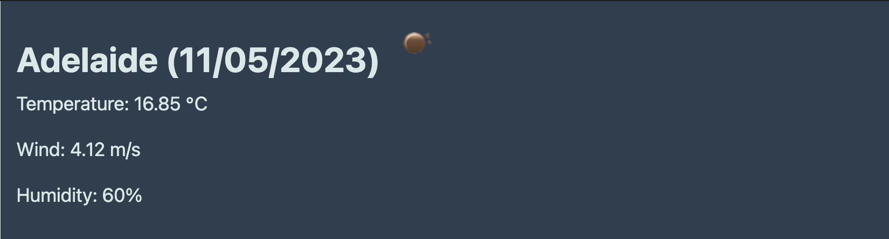
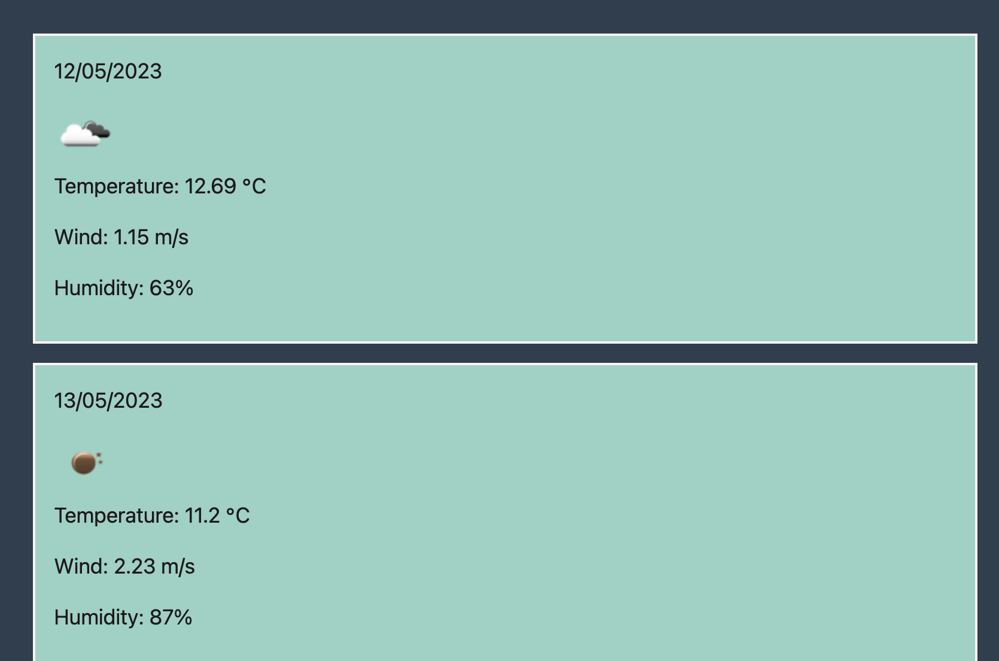
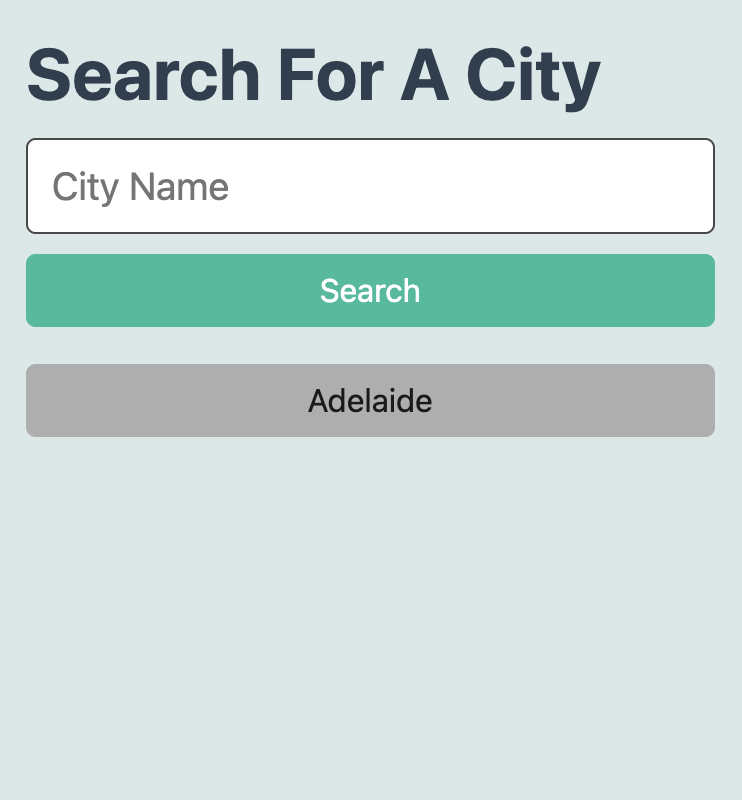

# Weather Dashboard
## Description

This weather dashbaord was built so that a user can input a city and be presented with current weather and 5 days forecast: [Weather Dashboard](https://retnodamayanti.github.io/weather-dashboard/)

## Installation

N/A

## Usage
- The screenshot below display the current weather 

- The screenshot below shows the 5 days forecast

- The screenshot below shows the search list

 
## Credit
- [API](https://openweathermap.org)
- [jass.css file](https://git.bootcampcontent.com/University-of-Adelaide/UADEL-VIRT-FSF-PT-03-2023-U-LOLC/-/tree/main/06-Server-Side-APIs/01-Activities/27-Stu_Mini-Project)

## License

Please refer to the LICENSE in the repo.